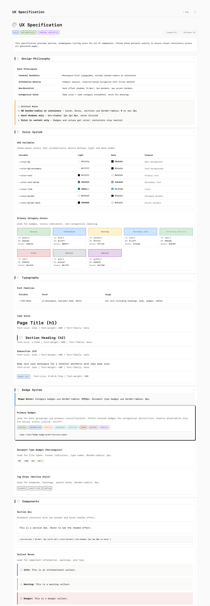

# UX Specification

A comprehensive UX design system with a live SvelteKit 2 reference implementation.



## Quick Start

```bash
# Install dependencies
bun install

# Start development server
bun run dev

# Build for production
bun run build

# Preview production build
bun run preview
```

## Project Structure

```
ux-spec/
  src/
    routes/
      +page.svelte      # Main UX specification page
      +layout.svelte    # App layout with header/footer
      icons/
        +page.svelte    # Icon reference with copy-to-clipboard
    lib/
      stores.svelte.ts  # Icon style state management
    app.css             # Design system CSS variables
    app.html            # HTML template with Font Awesome
  docs/
    UX-SPECIFICATION.md # Complete design specification
    skills/
      terminal-ui-design.md         # Terminal UI design skill
      default-website-style-guide.md # Website style guide skill
  static/
    fontawesome/        # Font Awesome Pro 6.1.1 (local)
```

## Design System

### Core Principles

| Principle | Implementation |
|-----------|----------------|
| Terminal Aesthetic | Monospace-first typography, minimal border-radius |
| Information Density | Compact layouts, sticky markers |
| Neo-Brutalist | Hard offset shadows (2px 2px 0px), 1px borders |
| Categorical Color | Same color = same category everywhere |

### Typography

- **h1**: Serif font (Palatino/Georgia)
- **h2-h6, body**: Monospace font (Iosevka/Cascadia Code)
- **Code**: Monospace with background highlight

### Badge System

| Type | Shape | Border Radius |
|------|-------|---------------|
| Category badges | Pill | 9999px |
| Status badges | Pill | 9999px |
| Tag chips | Rectangular | 3px |
| Document type | Rectangular | 3px |

### Color Variables

```css
--color-text: #1a1a1a;
--color-text-muted: #666666;
--color-bg: #fafafa;
--color-bg-secondary: #ffffff;
--color-border: #e0e0e0;
--color-border-dark: #1a1a1a;
--color-shadow: rgba(0, 0, 0, 0.15);
--color-accent: #2d5016;
```

## Pages

| Route | Description |
|-------|-------------|
| `/` | Main UX specification with live examples |
| `/icons` | Icon reference with 180+ icons by category |

## Documentation

See [docs/UX-SPECIFICATION.md](docs/UX-SPECIFICATION.md) for the complete design specification including:

- Color system with 15+ badge colors
- Typography scale and font stacks
- Component patterns (cards, tables, alerts, forms)
- Layout templates for 6 page types
- Responsive breakpoints

### Icon Reference

The `/icons` page provides:

- 10 categories (Interface, Navigation, Status, Communication, Data, Users, Shapes, Business, Technology, Media)
- 180+ commonly used icons
- Style selector (thin, light, regular, solid, duotone)
- Search functionality
- Copy-to-clipboard for icon class names

## Development

### Tech Stack

- **Runtime**: Bun
- **Framework**: SvelteKit 2
- **Language**: TypeScript
- **Styling**: CSS Variables

### Commands

| Command | Description |
|---------|-------------|
| `bun run dev` | Start dev server |
| `bun run build` | Production build |
| `bun run preview` | Preview build |
| `bun run check` | Type checking |

## Version

Current: v3.0

See [CHANGELOG.md](CHANGELOG.md) for release history.
